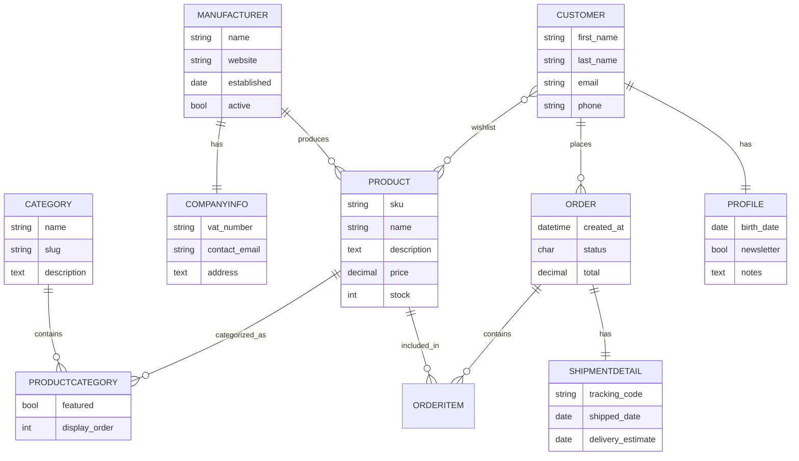

# Aplicacion_Web_Tienda_Hardware
Hay que hacer loaddata de datos_urls.json

1. Template Tags
    
    1- En la plantilla producto.html 
    
        <li>{{ categoria.name }}</li>
        <li><a href="">Ver más en esta categoría</a></li>
     {# Template tag empty 1 #}
        <li>Este producto no tiene categorías asignadas.</li> 
    

    2-En la plantilla manufacturer.html
         {# Template tag if not 2 #}
            ..contenido
        

    3-En el html product_list.html:
         {# Template tag include 3 #}

    4-En manufacturers_list.html:
         {# Template tag extends y block 4 #}
         {# Template tag extends y block 4 #}
        
            
        
         {# Template tag extends y block 4 #}
    
    5-En header.html:
         {# Template tag filter 5 #}
        esta es una descripción del sitio web en minúsculas y con caracteres escapados & < >
        

2. Operadores IF
    1-En la plantilla producto.html: Operador ==
         {# IF == 1 #}
            
Stock: Agotado

        
            
Stock: {{ productos.stock }}

        
    
    2-En la plantilla no_ordenados.html: Operador or
        
        
<strong>Fabricante: </strong>{{ producto.manufacturer.name }} (¡Fabricante destacado!)

        
    
    3-En la plantilla producto.html: Operador !=
         {# IF != 3 #}
            No es oferta
        

    4-En la plantilla detalles_producto.html: operador <
         {# IF < 4 #}
            
Precio: {{ producto_mostrar.price }} (Es barato)

        
            
Precio: {{ producto_mostrar.price }} Es un precio razonable 

        

    5-En la plantilla manufacturer.html: operador and
        
        
<strong>¡Fabricante destacado!</strong>

        

3.Uso de FILTERS
    1-FILTER DATE: pedido.html, manufacturer.html y last_order_for_product.html
        1.
Fecha: {{ pedido.created_at | date:"d/m/Y" }}

        2.
established: {{ manufacturers.established | date:"d/m/Y" }}

        3.
Fecha: {{ order.created_at | date:"d/m/Y" }} a las {{ order.created_at | time:"H:i" }}

    2-FILTER TIME: last_order_for_product.html
        
Fecha: {{ order.created_at | date:"d/m/Y" }} a las {{ order.created_at | time:"H:i" }}

    3-FILTER UPPER: producto.html
        
sku: {{ productos.sku | upper }}
 

    4-FILTER TITTLE: producto.html
        <h2> Nombre: {{ productos.name | title }}</h2>

    5-FILTER CAPFIRST: producto.html
        <li>{{ categoria.name | capfirst }}</li>

    6-FILTER CUT: manufacturer.html
        <h2> Nombre: {{ manufacturers.name | cut:"A" }}</h2>

    7-FILTER YESNO: manufacturer.html
        
active: {{ manufacturers.active | yesno:"Sí,No" }}

    8-FILTER LOWER: manufacturer.html
        <li>{{ producto.name | lower }}</li>

    9-FILTER LENGTH: pedido.html
        <li>{{ item.product.name }} length: {{ item.product.name|length }} - Cantidad: {{ item.quantity }} - Precio: {{ item.unit_price }} €</li>

    10-FILTER FIRST: ultimo.html
        <li>{{ item.product.name | first }} — Cantidad: {{ item.quantity }} — Precio: {{ item.unit_price }} €</li>

🌐 URLs principales (urls.py)
urlpatterns = [
    path('', views.home, name='home'),
    path('products/', views.product_list, name='product_list'),
    path('manufacturers/', views.manufacturers_list, name='manufacturers_list'),
    path('manufacturers/search/<str:texto>/', views.dame_fabricantes, name='dame_fabricantes'),
    path('product/<int:product_id>/', views.product_detail, name='product_detail'),
    re_path(r'^product/sku/(?P<sku>[A-Z0-9\-]{3,30})/$', views.product_by_sku, name='product_by_sku'),
    path('products/category/<str:slug>/', views.products_by_category, name='products_by_category'),
    path('manufacturers/date/<int:year>/<int:month>/', views.manufacturers_by_year_month, name='manufacturers_by_year_month'),
    path('clientes/<int:customer_id>/pedidos/', views.pedidos_cliente, name='pedidos_cliente'),
    path('orders/last-for-product/<int:product_id>/', views.last_order_for_product, name='last_order_for_product'),
    path('products/never-ordered/', views.products_never_ordered, name='products_never_ordered'),
]

Cada ruta conecta una URL con su vista correspondiente definida en views.py.

⚙️ Vistas principales (views.py)
Vista	Descripción breve
home	Página principal con enlaces a las demás.
product_list	Lista todos los productos con fabricante y categorías.
manufacturers_list	Muestra todos los fabricantes.
product_detail / product_by_sku	Detalle de producto por ID o SKU.
products_by_category	Filtra productos por categoría.
manufacturers_by_year_month	Filtra fabricantes por año y mes de fundación.
pedidos_cliente	Pedidos de un cliente concreto.
products_never_ordered	Productos que nunca se han pedido.
dame_fabricantes	Busca fabricantes activos por texto.
stats_manufacturers_products	Estadísticas de fabricantes con sus productos.
⚠️ Errores destacados y soluciones

FieldError: fecha_fundacion → usar established
→ El modelo no tenía ese campo.

NoReverseMatch
→ Enlaces usaban variables incorrectas. Se corrigió en el template y la URL.

Página en blanco al buscar fabricantes
→ El contexto debía llamarse fabricantes_mostrar.

Puerto en uso (8000)
→ Solución: sudo lsof -t -i:8000 | xargs kill -9.

⚠️ Páginas de error personalizadas

El proyecto define vistas para manejar los errores más comunes con plantillas específicas en templates/componentes/errores/.

Error	Vista	Plantilla	Descripción
400 — Bad Request	mi_error_400()	400.html	Se muestra cuando la petición no es válida.
403 — Forbidden	mi_error_403()	403.html	Aparece si el usuario no tiene permiso para acceder.
404 — Not Found	mi_error_404()	404.html	Página mostrada cuando la URL no existe.
500 — Server Error	mi_error_500()	500.html	Error interno del servidor.

Para activarlas en modo producción, se debe poner en settings.py:

DEBUG = False

y añadir en urls.py del proyecto principal:

handler400 = 'componentes.views.mi_error_400'
handler403 = 'componentes.views.mi_error_403'
handler404 = 'componentes.views.mi_error_404'
handler500 = 'componentes.views.mi_error_500'

Tipos de campo usados (no-relacionales):

CharField

TextField

DecimalField

PositiveIntegerField

IntegerField

BooleanField

DateField

DateTimeField

EmailField

URLField

Parámetros usados (ejemplos, al menos 10 distintos): max_length, unique, blank, null, default, validators, help_text, db_index, choices, max_digits, decimal_places, related_name, on_delete, auto_now_add, unique_together.

Estos parámetros aparecen repartidos por los modelos para cumplir la condición.

Modelos y explicación (extracto breve)

Manufacturer: fabricante; name (CharField, max_length=100, unique=True), website (URLField), established (DateField), active (BooleanField).

CompanyInfo: información fiscal y contacto del fabricante; manufacturer (OneToOneField), vat_number (CharField), contact_email (EmailField), address (TextField).

Category: categorías jerárquicas; parent es ForeignKey a self (on_delete=models.SET_NULL) para permitir categorías top-level.

Product: producto comercial; sku (único), price (DecimalField con max_digits y decimal_places y validator MinValueValidator(0)), stock (PositiveIntegerField), manufacturer (ForeignKey).

ProductCategory: tabla intermedia para atributos extras en la relación Product-Category; featured y display_order.

Customer: cliente; email único; wishlist ManyToMany a Product.

Profile: datos extendidos del cliente (OneToOne).

Order: pedido; status con choices (P, C, X), total DecimalField, products ManyToMany a Product through OrderItem.

ShipmentDetail: detalles de envío (OneToOne con Order)

OrderItem: línea del pedido (tabla intermedia entre Order y Product) con quantity y unit_price.

Parámetros usados (explicación corta)

max_length: longitud máxima para CharField y SlugField.

unique: obliga unicidad en base de datos.

null/blank: control de valores nulos y formularios.

default: valor por defecto.

validators: validadores (p.ej. MinValueValidator).

choices: lista de tuplas para limitar valores.

help_text, db_index, related_name, on_delete, auto_now_add — explicado brevemente en el README.

Explicación de código no visto en clase (más detallada)

unique_together (Meta): obliga unicidad combinada entre campos (product, category) para evitar duplicados en la tabla intermedia.

related_name: nombre inverso para relaciones (ej. manufacturer.products) que facilita consultas desde la instancia objetivo.

on_delete opciones: CASCADE, PROTECT, SET_NULL — se usan según la semántica: PROTECT evita borrar fabricantes si hay productos; SET_NULL permite mantener categorías si el padre se borra.

validators: se usan con campos numéricos para asegurar rangos.

auto_now_add=True en created_at guarda la fecha de creación automáticamente.

#Propiedades no usadas

manufacturer = models.ForeignKey(Manufacturer, on_delete=models.PROTECT)
Qué hace: Impide borrar un registro si otros lo están usando (protege la integridad).

class ProductCategory(models.Model):
    featured = models.BooleanField(default=False)
    display_order = models.IntegerField(default=0, validators=[MinValueValidator(0)])
Qué hace: Añadir campos personalizados a la relación (por ejemplo, si una categoría está destacada o el orden de visualización).

created_at = models.DateTimeField(auto_now_add=True)
default=timezone.now.
Qué hace: auto_now_add guarda automáticamente la fecha y hora de creación del registro.

name = models.CharField(max_length=100, unique=True, help_text="Nombre del fabricante")
name = models.CharField(max_length=60, db_index=True)
class Meta:
    unique_together = ('product', 'category')
manufacturer = models.ForeignKey(..., related_name='products')
Qué hacen:

help_text: texto de ayuda visible en el panel de administración.

db_index: crea un índice para búsquedas más rápidas.

unique_together: asegura unicidad combinada entre varios campos.

related_name: define el nombre inverso de la relación (no solo para evitar conflictos, como en los apuntes, sino también para acceder más claro desde el otro modelo).

website = models.URLField(blank=True, null=True)
contact_email = models.EmailField(null=True, blank=True)
slug = models.SlugField(max_length=70, unique=True)
price = models.DecimalField(max_digits=10, decimal_places=2, validators=[MinValueValidator(0)])
stock = models.PositiveIntegerField(default=0)
Qué hacen:

URLField y EmailField: validan automáticamente que el formato sea correcto.

SlugField: genera identificadores de texto amigables para URLs.

DecimalField: almacena decimales precisos (más exacto que FloatField).

PositiveIntegerField: igual que IntegerField, pero solo permite enteros ≥ 0.

from django.core.validators import MinValueValidator, MaxValueValidator
Qué hacen: Permiten limitar valores de campos numéricos. Por ejemplo, impedir precios negativos o limitar rangos.
